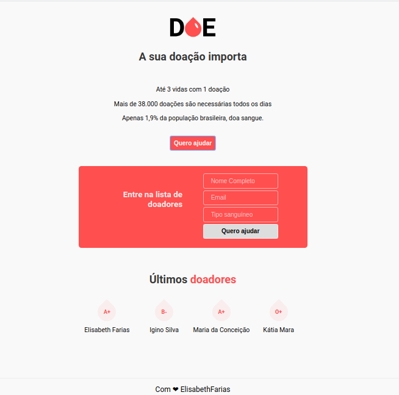

# ❤ Doe Sangue

<h1 align="center">
  
  
  
</h1>  

## Sobre este projeto

_" Projeto criado na 3º edição da Maratona Dev da Rocketseat, com intuito de efetuar o cadastramento de doadores de sangue."_

## ⚙️ Construído com

- [HTML](https://www.w3schools.com/html/)
- [CSS](https://www.w3schools.com/css/)
- [Javascript](https://www.w3schools.com/js/)
- [NodeJS](https://nodejs.org/en/)
- [Nunjucks](https://mozilla.github.io/nunjucks/)
- [Express](https://expressjs.com/pt-br/)
- [NPM](https://docs.npmjs.com/)
- [Nodemon](https://www.npmjs.com/package/nodemon)
- [PostgreSQL](https://www.postgresql.org/)

Doe sangue, doe vida! ❤ 